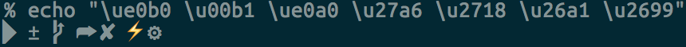

# Welcome 👋

This is my personal dotfiles in its current (most likely not final) form. It's
using a git bare repo along with a hand crafted installation CLI.

## What's included?

- [Brew](https://brew.sh/) and Brew cask programs
- [iTerm2] is still my weapon of choice. Might move to Warp once they improve
  Fish support
- [Fish shell](https://fishshell.com/) & [Fisher](https://github.com/jorgebucaran/fisher)
- [Starship](https://starship.rs/) prompt
- A couple of fonts, some of which from [Nerd Fonts](https://www.nerdfonts.com/)
- Bare repo with no aliases for dotfiles 🎉

## Installation and setup instructions

1. Clone the repo in your home root. See this [guide for more details](https://www.ackama.com/what-we-think/the-best-way-to-store-your-dotfiles-a-bare-git-repository-explained/).
2. Run the binary included in the source, or install Deno and run `deno run ./install/install.ts`.
3. Set iterm2 theme and fonts.
4. Debug colors, syntax highlighting etc
5. If you are using PGP and have your GPG key stored on Keybase, check out this
   guide: https://blog.scottlowe.org/2017/09/06/using-keybase-gpg-macos/

- I really recommend authenticating with Github using their CLI (`gh`), this is
  a lot easier than generating and setting SSH keys.

## Updating your dotfiles

I've added Fish alias to make it easy to update your dotfiles, simply run
`configure` to enter "maintenance mode". This will alias git to make it easier
to work with the bare repo.

## Fonts

- Vscode: Dank Mono, FiraCode Nerd Font, Menlo, Monaco, Courier New, monospace
- iTerm: FiraCode Nerd Font Mono

Note: Only Dank mono is included in this repo. You need to install the others
separately:

- https://github.com/ryanoasis/nerd-fonts/tree/master/patched-fonts/FiraCode

### Troubleshooting

- Is is something wrong with the fonts? Try `echo "\ue0b0 \u00b1 \ue0a0 \u27a6
\u2718 \u26a1 \u2699"`. This should look like this 
- The install script should change shell for you, but in case it doesn't here's
  how you do it: `chsh -s $(which fish)`. You might have to add
  `/opt/homebrew/bin/fish` to `/etc/shells` for this to work: `sudo echo
/opt/homebrew/bin/fish >> /etc/shells`.

- For Celery (GDAL really) to work make sure `DYLD_LIBRARY_PATH` is set:
  ```
  ~/Desktop via  v19.3.0 on ☁️  (eu-central-1)
  ❯ echo $DYLD_LIBRARY_PATH
  /opt/homebrew/lib/
  ```
